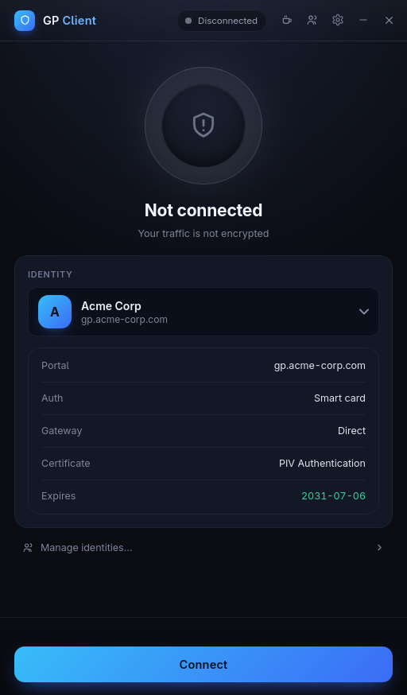
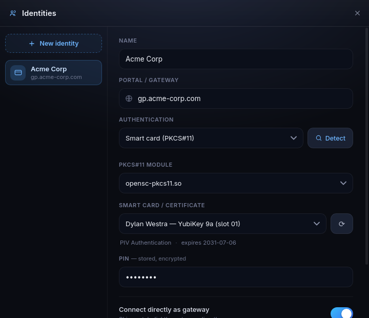
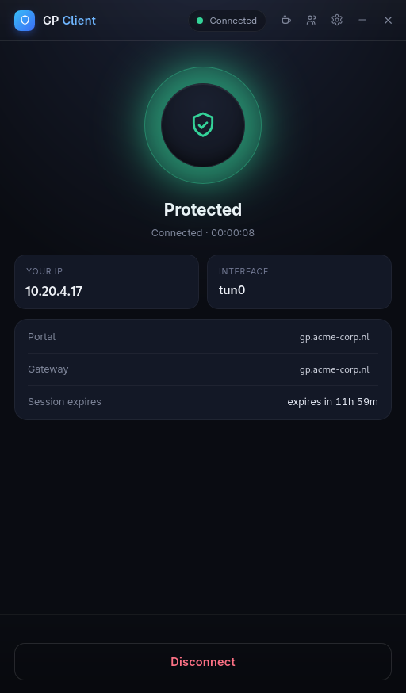
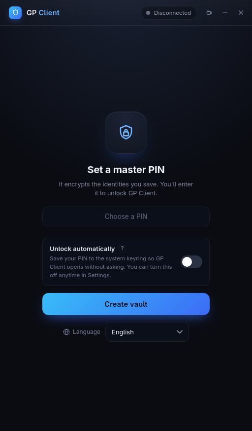
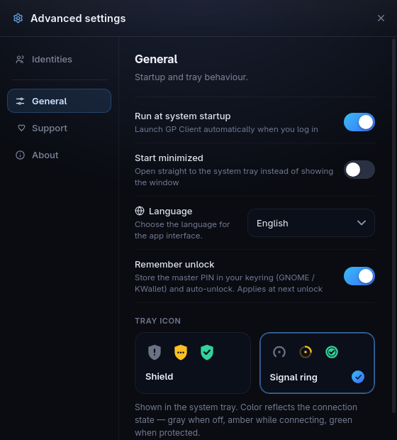
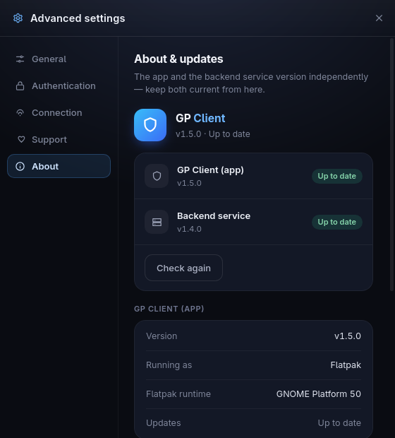

# GP Client

[](https://github.com/techneut92/gp-client/releases/latest)
[](https://copr.fedorainfracloud.org/coprs/techneut92/gp-client/package/gp-client/)
[](./LICENSE)
[](https://github.com/techneut92/gp-client/releases)
[](https://ko-fi.com/techneut92)

A GlobalProtect-compatible VPN client for Linux, with a modern **Svelte + Tauri**
GUI. Sign in with a **smart card / PKCS#11** (YubiKey PIV) certificate, **SAML
single sign-on**, or a **password**; save multiple connections in an encrypted
vault; and manage the tunnel from a system-tray icon.

GP Client is the standalone GUI successor to the `gpgui` app that shipped inside
[GlobalProtect-openconnect-dw](https://github.com/techneut92/GlobalProtect-openconnect-dw);
it versions independently and talks to that project's privileged `gpservice`
backend over [`gp-protocol`](https://github.com/techneut92/gp-protocol).

> **GlobalProtect** is a trademark of Palo Alto Networks. This is an independent,
> compatible client and is not affiliated with or endorsed by Palo Alto Networks.

<p align="center">
  
</p>
<p align="center"><em>Connect with a smart-card (PKCS#11 / YubiKey PIV) identity.</em></p>

<details>
<summary><b>More screenshots</b></summary>

<p align="center">
  
  
</p>
<p align="center"><em>Identity manager (PKCS#11 / YubiKey) · Connected and protected.</em></p>

<p align="center">
  
  
  
</p>
<p align="center"><em>Encrypted vault · settings · About (app + backend status).</em></p>

</details>

## Contents

- [Features](#features)
- [Architecture](#architecture)
- [Install](#install)
- [Development](#development)
- [Support](#support)
- [License](#license)

## Features

### Identities & vault

- **Encrypted identity vault** — every saved connection (including its secrets:
  smart-card PIN, password, key passphrase) lives in a ChaCha20-Poly1305
  encrypted file under a key derived from your **master PIN** (Argon2id,
  above-default cost). Plaintext exists in memory only while unlocked; the file
  is written atomically at mode 0600, and the master PIN itself is never stored.
- **Keyring auto-unlock (opt-in)** — remember the master PIN in your desktop
  secret store (GNOME Keyring / KWallet / COSMIC) so the app unlocks on launch.
  Off by default; any keyring problem falls back to the normal PIN prompt.
- **Multiple identities** — save any number of named profiles (e.g. "Acme Corp"
  → `gp.acme.example`) and switch from the main window or the tray.
- **Forgotten-PIN reset** — start over with a fresh vault (saved identities are
  unrecoverable by design — they were encrypted under the lost PIN).

### Authentication

- **Smart card / PKCS#11** — client-certificate login with a YubiKey PIV or any
  PKCS#11 token: auto-detected modules (OpenSC, YubiKey ykcs11, SoftHSM,
  p11-kit), live on-card certificate listing with cardholder, PIV slot, model
  and expiry (renewals show up immediately; soon-to-expire is flagged), and a
  PIN that is either stored encrypted or prompted per connect and never saved.
- **SAML / SSO** — an embedded sign-in webview (auto-completes silently when
  your IdP session is still valid), or your **system browser** for IdPs that
  block embedded views — GP Client registers the `globalprotectcallback:`
  scheme to catch the redirect.
- **Certificate file** — PEM or PKCS#12, with optional separate key file and
  encrypted passphrase.
- **Username & password** — standard credentials, stored encrypted.
- **Auto-detect** — one click probes the server's prelogin (through the
  backend, including the mTLS handshake) and picks the right method for you.

### Networking

- **Scoped DNS per identity** — list the domains that should resolve through
  the VPN's DNS; everything else stays on your normal resolvers. Empty list =
  all DNS through the VPN while connected (the classic behavior). Requires
  backend ≥ 1.5.
- **Guaranteed DNS cleanup** *(backend ≥ 1.5)* — the backend reverts the
  tunnel's DNS configuration on every session end, even abnormal ones, so a
  dead session can never leave your system stuck on unreachable VPN resolvers.
- **Fast, leak-proof resume** — on wake from sleep the backend re-pins the
  gateway route to the physical NIC and reconnects in-place within seconds; the
  tunnel is never torn down, so nothing escapes it while the network returns.
- **Honest states** — Connected, Reconnecting and Disconnecting are distinct;
  the UI never claims "Connected" over a dead tunnel.
- **Advanced tunnel tuning** — reported OS/version/User-Agent/client version,
  MTU, reconnect timeout, DPD interval, IPv6 off, DTLS off, no-xmlpost,
  ignore-TLS-errors, custom vpnc-script and local hostname.

### Desktop integration

- **System tray** — state-aware icon (two styles: shield or signal ring; grey /
  amber / green), a "Connect with" submenu over your identities, disconnect and
  quit. Native on KDE and COSMIC; GNOME needs the AppIndicator extension.
- **Close-to-tray, start-minimized, autostart** — the window hides while the
  tunnel keeps running; optional XDG autostart (with hidden start).
- **Desktop notifications** on connect, disconnect, errors and available updates.
- **Session display** — tunnel IP and interface, gateway, live connection timer
  and a session-expiry countdown.
- **Wayland-friendly** — reliable window raise/focus on COSMIC and GNOME
  Wayland, tiling-WM float hints (Pop Shell), single-instance guard that also
  works inside the Flatpak sandbox.

### Backend & installs

- **Privilege separation** — the GUI is unprivileged; the tunnel runs in the
  [`gpservice`](https://github.com/techneut92/GlobalProtect-openconnect-dw)
  root backend, reached over the D-Bus system bus with **polkit** gating (an
  active local user connects without a password prompt). If the GUI dies, a
  watchdog tears the tunnel down — `tun0` is never left dangling.
- **Guided backend install/updates** — missing or outdated backend? A guided
  screen installs the right package via one pkexec prompt (dnf, apt, pacman,
  zypper, apk and **rpm-ostree** for atomic distros), with copyable manual
  steps as fallback, plus a one-button "Update all" flow and update badges.
- **Migration from gpgui** — one-time import of the predecessor app's vault and
  settings (same master PIN), with optional removal of the old app.

### Languages

- **English, Dutch (Nederlands) and Frisian (Frysk)** — switchable at runtime
  (or follow the system), localized desktop entry included.

### Known limitations

- **Gateway mode only** — identities must use "connect directly as gateway";
  portal-mode connections (portal login incl. RSA/MFA token challenges,
  gateway list + selection) are not supported yet — tracked in
  [GlobalProtect-openconnect-dw#47](https://github.com/techneut92/GlobalProtect-openconnect-dw/issues/47).

## Architecture

GP Client is split into an unprivileged GUI and a privileged backend that talk
over a stable wire contract:

```
┌─────────────────┐   gp-protocol    ┌──────────────────────────┐
│  gp-client (UI) │ ───────────────► │  gpservice (root backend)│
│  Tauri + Svelte │   D-Bus system   │  openconnect + tun0      │
│  unprivileged   │ ◄─────────────── │  runs the actual tunnel  │
└─────────────────┘  (polkit-gated)  └──────────────────────────┘
```

- **`gp-client`** (this repo) is the unprivileged GUI: tray, transport, the
  encrypted vault, config, updater and single-instance handling. It performs the
  interactive parts of authentication (the SAML webview, PIN entry) and links
  **no GPL-licensed code**.
- **`gpservice`** is the privileged backend that owns the OpenConnect FFI and the
  `tun0` device. It runs prelogin, portal/gateway login and the tunnel itself,
  driven over [`gp-protocol`](https://github.com/techneut92/gp-protocol) on the
  D-Bus system bus (polkit-gated). It ships as a separate host package because a
  VPN tunnel can't be sandboxed.

## Install

GP Client (the GUI) and the `gpservice` backend install separately.

1. **The GUI** — Flatpak is the recommended channel (Flathub submission pending);
   native `.deb`, `.rpm`, AppImage, Arch and Alpine packages are attached to each
   [release](https://github.com/techneut92/gp-client/releases):

   ```bash
   curl -fLO https://github.com/techneut92/gp-client/releases/latest/download/io.github.techneut92.GPClient.flatpak
   flatpak install --user --or-update --assumeyes io.github.techneut92.GPClient.flatpak
   flatpak run io.github.techneut92.GPClient
   ```

2. **The backend** — install the `gpservice` host package from the
   [backend releases](https://github.com/techneut92/GlobalProtect-openconnect-dw/releases)
   (`.rpm` / `.deb` / `.pkg.tar.zst` / `.apk`, or the Fedora COPR / Ubuntu apt repo).
   On first run GP Client detects whether a compatible backend (**≥ 1.3.1**) is
   present and, if not, shows an install/upgrade screen with the exact command for
   your distribution.

Migrating from the old `gpgui` app? On first launch GP Client offers to import
your identities and settings and remove the old app in one click.

## Development

The repository has three domains:

```
gp-client/
├── ui/          # the web frontend (Svelte + Vite): pages, components, i18n
├── src-tauri/   # the Rust/Tauri application (tray, transport, vault, updater)
├── packaging/   # flatpak · flathub · rpm · arch · alpine · linux desktop
└── docs/        # packaging notes, screenshots
```

Install the frontend deps with pnpm in `ui/`, then run the Tauri CLI **from the
repo root** (it locates `src-tauri/` as a subfolder, and its `beforeBuildCommand`
builds the frontend in `ui/` automatically):

```bash
pnpm -C ui install
ui/node_modules/.bin/tauri dev      # runs against a local gpservice
ui/node_modules/.bin/tauri build
```

Packaged builds are built with `--features custom-protocol` (the release CI does
this) so the frontend is embedded; otherwise the app loads the UI from the Vite
dev server at `localhost:5173`. See [`docs/packaging.md`](docs/packaging.md) for
the per-distribution build notes, and [`CHANGELOG.md`](CHANGELOG.md) for release
history.

## Support

If this project saves you some time, you can support its development:

- **Ko-fi** — [ko-fi.com/techneut92](https://ko-fi.com/techneut92) (one-off tips, no account needed)
- **Revolut** — [revolut.me/techneut92](https://revolut.me/techneut92)
- **Ethereum (ETH)** — `0x15d9B8383A7cbe9f99F72aC29106C53bbcf4ea40` (Ethereum network; ETH / ERC-20 only)

[](https://ko-fi.com/techneut92)
[](https://revolut.me/techneut92)

## License

Copyright © 2026 Dylan Westra (techneut92).

GP Client is free software, licensed under the **GNU General Public License,
version 3 or later (GPL-3.0-or-later)** — see [`LICENSE`](LICENSE). As the sole
copyright holder, the author may also make the software available under other
terms.

The GUI itself links no GPL-licensed code; the copyleft backend (`gpservice`) is
a separate program, reached only over the `gp-protocol` D-Bus contract, and is
distributed under its own license.
